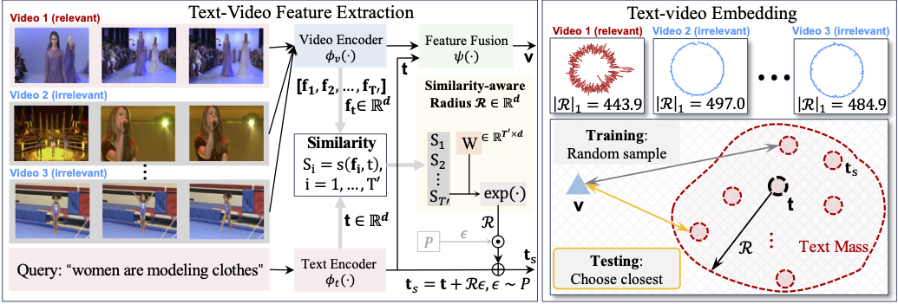

# Text Is MASS: Modeling as Stochastic Embedding for Text-Video Retrieval (CVPR 2024)

[Jiamian Wang](https://jiamian-wang.github.io/), [Guohao Sun](https://github.com/heliossun), [Pichao Wang](https://wangpichao.github.io/), [Dongfang Liu](https://dongfang-liu.github.io/), [Sohail Dianat](https://www.rit.edu/directory/sadeee-sohail-dianat), [Majid Rabbani](https://www.rit.edu/directory/mxreee-majid-rabbani), [Raghuveer Rao](https://ieeexplore.ieee.org/author/37281258600), [Zhiqiang Tao](https://ztao.cc/), "Text Is MASS: Modeling as Stochastic Embedding for Text-Video Retrieval".

[[Paper](https://arxiv.org/abs/2403.17998)] [[Pretrained Models](https://drive.google.com/drive/folders/165PUfnutKRj2_cgjHZE3mIIa8f4kmY6x?usp=sharing)] 

---

> **Abstract:** *The increasing prevalence of video clips has sparked growing interest in text-video retrieval. Recent advances focus on establishing a joint embedding space for text and video, relying on consistent embedding representations to compute similarity. However, the text content in existing datasets is generally short and concise, making it hard to fully describe the redundant semantics of a video. Correspondingly, a single text embedding may be less expressive to capture the video embedding and empower the retrieval. In this study, we propose a new stochastic text modeling method T-MASS, i.e., text is modeled as a stochastic embedding, to enrich text embedding with a flexible and resilient semantic range, yielding a text mass. To be specific, we introduce a similarity-aware radius module to adapt the scale of the text mass upon the given text-video pairs. Plus, we design and develop a support text regularization to further control the text mass during the training. The inference pipeline is also tailored to fully exploit the text mass for accurate retrieval. Empirical evidence suggests that T-MASS not only effectively attracts relevant text-video pairs while distancing irrelevant ones, but also enables the determination of precise text embeddings for relevant pairs. Our experimental results show a substantial improvement of  T-MASS over baseline (3%~6.3% by R@1). Also, T-MASS achieves state-of-the-art performance on five benchmark datasets, including MSRVTT, LSMDC, DiDeMo, VATEX, and Charades.*


>
> <p align="center">
> 
> </p>


---

## Content

1. [Dependencies](#Dependencies)
1. [Dataset](#Dataset)
1. [Evaluation](#Evaluation)
1. [Training](#Training)
1. [Citation](#Citation)
1. [Acknowledgement](#Acknowledgement)
1. [Contact](#Contact)


## Dependencies

- PyTorch 1.12.1 
- OpenCV 4.7.0
- transformers 4.30.2

## Dataset
To download MSRVTT, LSMDC, and DiDeMo, please follow [CLIP4Clip](https://github.com/ArrowLuo/CLIP4Clip). 

You will need to request a permission from MPII to download and use the Standard LSMDC data.

For LSMDC, download the data split csv files into `./data/LSMDC/`. 

For DiDeMo, using `gdrive` to download video data is recommended. 
One may consider
- Setup [gdrive](https://github.com/glotlabs/gdrive#requirements) by following "Getting started".
- Download video data by `gdrive files download --recursive FOLDER_ID_FROM_URL`

| Dataset | Video Clips | Text-Video Pairs |Scale| Link |
|:-----------:|:-----------:| :-----------: | :-----------: | :-----------: |
|MSR-VTT|10K|one-to-twenty|6.7Gb|[link](https://github.com/ArrowLuo/CLIP4Clip)|
|LSMDC|118081|one-to-one|1.3Tb|[link](https://github.com/ArrowLuo/CLIP4Clip)|
|DiDeMo|10464|one-to-many|581Gb|[link](https://drive.google.com/drive/u/1/folders/1_oyJ5rQiZboipbMl6tkhY8v0s9zDkvJc)|


## Evaluation

Download the checkpoints into `./outputs/{Dataset}/{FOLDER_NAME_UNDER_*Dataset*}`. 

Repeat testing process for `--stochasic_trials` causes either time or memory computational overhead. The sequential strategy provided is more memory-friendly. We adopt `--seed=24` and `--stochasic_trials=20` for all methods.  One may consider specifying `--save_memory_mode` for larger datasets or computational-constrained platforms at evaluation. Same as XPool, the evaluation is default to text-to-video retrieval performance (i.e., `--metric=t2v`), for video-to-text retrieval performance, specify `--metric=v2t`. For post processing operation evaluation results of DSL, specify `--DSL`. 

Replace `{videos_dir}` with the path to the dataset.

| Dataset | Command | Checkpoint File | t2v R@1 Result | 
|:-----------:|:-----------:| :-----------: | :-----------: |
|MSR-VTT-9k|`python test.py --datetime={FOLDER_NAME_UNDER_MSR-VTT-9k}   --arch=clip_stochastic   --videos_dir={VIDEO_DIR}  --batch_size=32 --noclip_lr=3e-5 --transformer_dropout=0.3  --dataset_name=MSRVTT --msrvtt_train_file=9k   --stochasic_trials=20 --gpu='0'  --load_epoch=0   --exp_name=MSR-VTT-9k`| [Link](https://drive.google.com/drive/folders/1YKRApCC6D0AyEpPlmruxpZPJZUBkHMKa?usp=sharing)       | 50.2| 
|LSMDC|`python test.py --arch=clip_stochastic    --exp_name=LSMDC --videos_dir={VIDEO_DIR}  --batch_size=32 --noclip_lr=1e-5 --transformer_dropout=0.3 --dataset_name=LSMDC    --stochasic_trials=20 --gpu='0' --num_epochs=5  --stochastic_prior=normal --stochastic_prior_std=3e-3 --load_epoch=0 --datetime={FOLDER_NAME_UNDER_LSMDC}`| [Link](https://drive.google.com/file/d/1CEAEdVq_HaPr-emg9ge1HPoaWNqaTjne/view?usp=sharing)       |28.9| 
|DiDeMo|`python test.py  --num_frame=12 --raw_video  --arch=clip_stochastic  --exp_name=DiDeMo --videos_dir={VIDEO_DIR} --batch_size=32 --noclip_lr=1e-5 --transformer_dropout=0.4  --dataset_name=DiDeMo    --stochasic_trials=20 --gpu='0' --num_epochs=5   --load_epoch=0 --datetime={FOLDER_NAME_UNDER_DiDeMo}`| [Link](https://drive.google.com/drive/folders/1-udbr1xINzHjXx75RptRo2vUpdXY5VxF?usp=sharing)       |50.9|


## Training 
Run the following training code to resume the above results. Take MSRVTT as an example, one may consider support text regularization by specifying `--support_loss_weight`. `--evals_per_epoch` can be enlarged to select a better checkpoint. The CLIP model is default to `--clip_arch=ViT-B/32`. To train on a larger CLIP backbone, speficy `--clip_arch=ViT-B/16`. One may enlarge the training epochs `--num_epochs` by one or two when the dataset is incomplete for a better performance.  

| Dataset | Command | 
|:-----------:|:-----------:|
|MSR-VTT-9k|`python train.py  --arch=clip_stochastic    --exp_name=MSR-VTT-9k --videos_dir={VIDEO_DIR}  --batch_size=32 --noclip_lr=3e-5 --transformer_dropout=0.3  --dataset_name=MSRVTT --msrvtt_train_file=9k     --stochasic_trials=20 --gpu='0' --num_epochs=5  --support_loss_weight=0.8`|
|LSMDC|`python train.py --arch=clip_stochastic   --exp_name=LSMDC --videos_dir={VIDEO_DIR}  --batch_size=32 --noclip_lr=1e-5 --transformer_dropout=0.3 --dataset_name=LSMDC    --stochasic_trials=20 --gpu='0'  --num_epochs=5  --stochastic_prior=normal --stochastic_prior_std=3e-3`|
|DiDeMo|`python train.py  --num_frame=12 --raw_video  --arch=clip_stochastic   --exp_name=DiDeMo --videos_dir={VIDEO_DIR} --batch_size=32 --noclip_lr=1e-5 --transformer_dropout=0.4 --dataset_name=DiDeMo     --stochasic_trials=20 --gpu='0' --num_epochs=5`| 


## Citation
If you find this work valuable for your research, we kindly request that you cite the following paper:

```
@inproceedings{wang2024text,
  title={Text Is MASS: Modeling as Stochastic Embedding for Text-Video Retrieval}, 
  author={Wang, Jiamian and Sun, Guohao and Wang, Pichao and Liu, Dongfang and Dianat, Sohail and Rabbani, Majid and Rao, Raghuveer and Tao, Zhiqiang},
  booktitle={Proceedings of the IEEE/CVF conference on computer vision and pattern recognition (CVPR)},
  year={2024}
}
```

## Acknowledgement

This code is built on [XPool](https://github.com/layer6ai-labs/xpool). Great thanks to them!

## Contact

For discussions, please feel free to submit an issue or contact me via email at jiamiansc@gmail.com.

